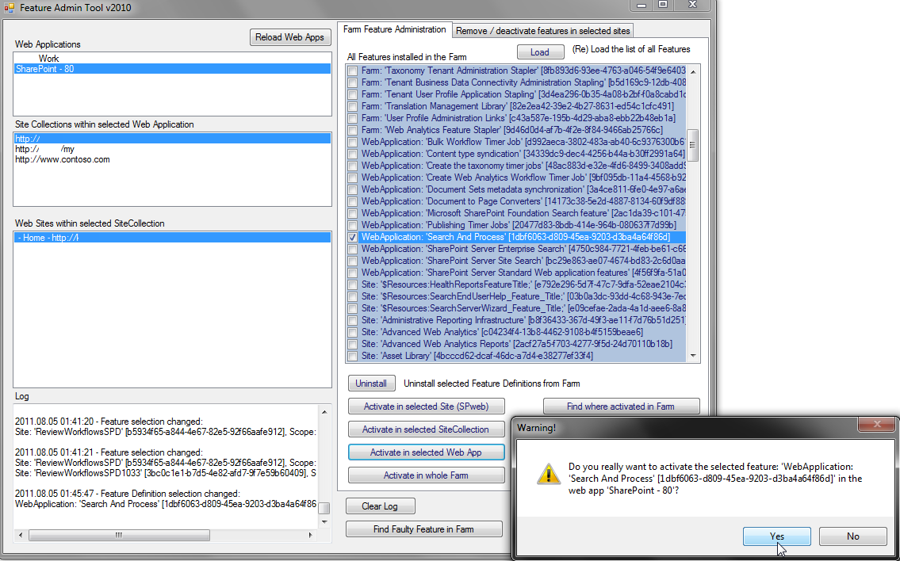

# FeatureAdmin

SharePoint Feature Administration and Clean Up Tool

## Functionality

This is a tool to manage SharePoint features. It allows you to

* See and search available feature definitions
* Quickly get to and search within all locations, where features can be activated in SharePoint (Farm, Web Apps, Sites, Webs)
* Identify, where which features are activated
* Identify and cleanup orphaned/faulty/broken features and feature definitions that often cause issues (e.g. when installing CUs or when exporting and importing sites)
* Activate, Deactivate and Upgrade features (, even in multiple locations (bulk), when selecting a parent location)
* Uninstall feature definitions

## Downloads

These are links to release downloads for the different SharePoint versions:

**Attention!** For feature administration, v. 2.4.8 is currently the best release, but if you are experiencing issues in removing faulty features, please use release 2.4.6 instead - we are working on a fixed version ...

### SP 2013

* [Download release zip (v. 2.4.8) including license and release notes](https://github.com/achimismaili/featureadmin/raw/master/Releases/Sp2013/2.4.8/FeatureAdmin2013.zip)
* [Download executable only (v. 2.4.8)](https://github.com/achimismaili/featureadmin/raw/master/Releases/Sp2013/2.4.8/FeatureAdmin2013.exe)
* [Download release zip (v. 2.4.6) including license and release notes](https://github.com/achimismaili/featureadmin/raw/master/Releases/Sp2013/2.4.6/FeatureAdmin2013.zip) (recommended for removing orphaned/faulty features)
* [Download executable only (v. 2.4.6)](https://github.com/achimismaili/featureadmin/raw/master/Releases/Sp2013/2.4.6/FeatureAdmin2013.exe) (recommended for removing orphaned/faulty features)

### SP 2010

* [Download release zip (v. 2.4.8) including license and release notes](https://github.com/achimismaili/featureadmin/raw/master/Releases/Sp2010/2.4.8/FeatureAdmin2010.zip)
* [Download executable only (v. 2.4.8)](https://github.com/achimismaili/featureadmin/raw/master/Releases/Sp2010/2.4.8/FeatureAdmin2010.exe)
* [Download release zip (v. 2.4.6) including license and release notes](https://github.com/achimismaili/featureadmin/raw/master/Releases/Sp2010/2.4.6/FeatureAdmin2010.zip) (recommended for removing orphaned/faulty features)
* [Download executable only (v. 2.4.6)](https://github.com/achimismaili/featureadmin/raw/master/Releases/Sp2010/2.4.6/FeatureAdmin2010.exe) (recommended for removing orphaned/faulty features)

### SP 2007

* [Download release zip (v. 2.4.8)](https://github.com/achimismaili/featureadmin/raw/master/Releases/Sp2007/2.4.8/FeatureAdmin2007.zip)
* [Download executable only (v. 2.4.8)](https://github.com/achimismaili/featureadmin/raw/master/Releases/Sp2007/2.4.8/FeatureAdmin2007.exe)
* [Download release zip (v. 2.4.6)](https://github.com/achimismaili/featureadmin/raw/master/Releases/Sp2007/2.4.6/FeatureAdmin2007.zip) (recommended for removing orphaned/faulty features)
* [Download executable only (v. 2.4.6)](https://github.com/achimismaili/featureadmin/raw/master/Releases/Sp2007/2.4.6/FeatureAdmin2007.exe) (recommended for removing orphaned/faulty features)

### Demo
* [Download release zip (v. 3.0.0) including license and release notes](https://github.com/achimismaili/featureadmin/raw/master/Releases/demo/FeatureAdminDemo.zip)
* [Download executable only (v. 3.0.0)](https://github.com/achimismaili/featureadmin/raw/master/Releases/demo/FeatureAdminDemo.exe)

## Development

Here you find download links for releases that might still be in beta, not as stable or that are still under development. These releases are not recommended for production use.

See also the [Release Notes](Releases/ReleaseNotes.md)

### SP 2013

* [Download release zip (current developer version) including license and release notes](https://github.com/achimismaili/featureadmin/raw/development/Releases/Sp2013/FeatureAdmin2013.zip)
* [Download executable only (current developer version)](https://github.com/achimismaili/featureadmin/raw/development/Releases/Sp2013/FeatureAdmin2013.exe)

### Demo

* [Download release zip (current developer version) including license and release notes](https://github.com/achimismaili/featureadmin/raw/development/Releases/demo/FeatureAdminDemo.zip)
* [Download executable only (current developer version)](https://github.com/achimismaili/featureadmin/raw/development/Releases/demo/FeatureAdminDemo.exe)

## Installation

* Requires no installation
* Just (a download/copy of) the EXE file is required
* Please start the EXE file on a SharePoint Web Front End (WFE) with as much as possible rights
* Regarding rights, please also check _[recommended permissions for running FeatureAdmin](docs/Rights.md)_

<!-- ## Tool Description
FeatureAdmin is a tool for SharePoint administrators and developers to manage SP features. It finds and cleans faulty FeatureDefinitions and orphaned reminders.

The Feature Admin Tool finds faulty FeatureDefinitions and cleanly uninstalls them.
It finds feature remainders in sites, SiteCollections, WebApps and in the Farm, caused e.g. by forcefully uninstalled Features from a farm without deactivating them before. These faulty features, never visible, cause errors.
The Feature Admin Tool is able to identify them and remove them.
Very useful for major version upgrades e.g. to 2010 or 2013, or for downgrades from Enterprise to Standard.

Also, uninstall, (bulk) deactivate or (bulk) activate features with any scope farm wide.
Ideal, for activating or deactivating features in large farms with many sites and/or SiteCollections. -->

## Links

* [Homepage](https://www.featureadmin.com)
* [Source Code](https://github.com/achimismaili/featureadmin)
* [Release Notes](Releases/ReleaseNotes.md)
* [License](LICENSE.md)
* Some additional [technical Documentation](docs/Documentation.md)

## What others are saying about this tool
- _**"It's been a very useful yet very powerful tool."**_, by **[(SharePoint-)Joel Oleson](http://www.sharepointjoel.com/Lists/Posts/Post.aspx?ID=469)**
- _"Swiss Army knife for managing features in SharePoint"_, by **[The SharePoint Nomad](http://sharepointnomad.wordpress.com/2010/05/22/262/)**
- _"Tool that can find faulty features and remove them from the system"_,
>{from the book: "[Windows Small Business Server 2011 - Das Handbuch](http://www.amazon.de/Microsoft-Windows-Business-Server-Standard/dp/3866451385/ref=sr_1_1?s=books&ie=UTF8&qid=1307103905&sr=1-1)", page 187, by **[Thomas Joos](http://thomasjoos.wordpress.com/books/)**}>
- _"... does a great job in listing Feature Definitions across Site Collections and Sub Webs and cleanly uninstalling them."_,
>{by  **[(SharePoint-)George Khalil](http://sharepointgeorge.com/2009/upgrading-content-db-sharepoint-2010-part-1-preupgradecheck/)**}>
- _"Tool to remove missing features"_, by **[Paul King, Microsoft](http://blogs.msdn.com/b/paulking/archive/2011/10/05/removing-missingfeature-database-amp-missingwebpart-webpart-class-errors-from-sharepoint-2010.aspx)**
- _**"Oh my God, your product saved my job!"**_, by jasonengberg
- _**"This tool saved me from pulling out the remaining hair that I have. Worked like a charm."**_, by rsreagan
- _"I loved it. This is the best tool to use when in jamm with orphaned features"_, by nee2ok
- _"Saved my day!!! Thanks..."_, by vinodkumarpvk
- _"Champion! Love it! Thank you SOOOOO much!"_, by drewberrylicious
- _"Excellent tool."_, by rarandas

<!-- ... if the _Feature Admin Tool_ was able to help you, too, please rate it. -->

<!-- ## 'Features' of the FeatureAdmin Tool
* Web Apps are parsed automatically, after selecting one, all Site Collections in the Web App are shown
* When selecting a SiteCollection, all sites (webs) are listed automatically.
* logging information is shown (e.g. change of selections, features added or removed)
* Features and Feature Definitions are sorted (first after scope and then) after name
* The FeatureAdmin window and all internal windows are resizeable (starting with version 2.1) -->

<!-- ## Screenshots
Feature View - remove Features

Feature Definition View - activate or uninstall Features
 -->

<!-- ## The Problem, that triggered development of this tool:
After doing Solution Package based deployment for a while, I found out, that 'stsadm -o upgradesolution' is not supported, when features are added / removed. (see article about this [http://sharepointtipoftheday.blogspot.com/2009/06/solution-feature-upgrading-and.html](http://sharepointtipoftheday.blogspot.com/2009/06/solution-feature-upgrading-and.html))
Also, I had some cases, where Features had forcefully been uninstalled from a farm without deactivating them first in all Sites / SiteCollections / WebApps or in the Farm.

All this has caused errors and left overs in the Farm, e.g. it was not possible to open the WorkFlow Overview page in several SiteCollections, because it was complaining about missing Features. Also, when doing exports, you might run in the error: FatalError: Failed to compare two elements in the array.
## Roots of the Feature Admin Tool
I found the Faulty Feature Tool from "Steven Van de Craen", at
[http://www.moss2007.be/blogs/vandest/archive/2008/04/28/stsadm-o-export-fatalerror-failed-to-compare-two-elements-in-the-array.aspx](http://www.moss2007.be/blogs/vandest/archive/2008/04/28/stsadm-o-export-fatalerror-failed-to-compare-two-elements-in-the-array.aspx)
which solved some of my problems. It was very basic and I needed it for a lot more. -->